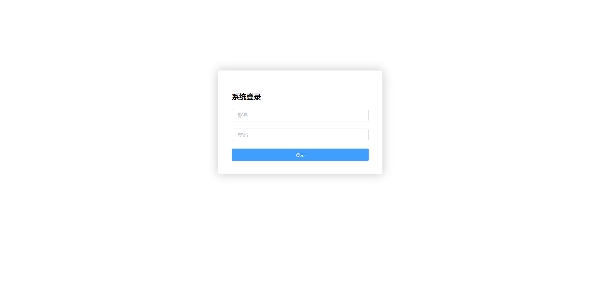
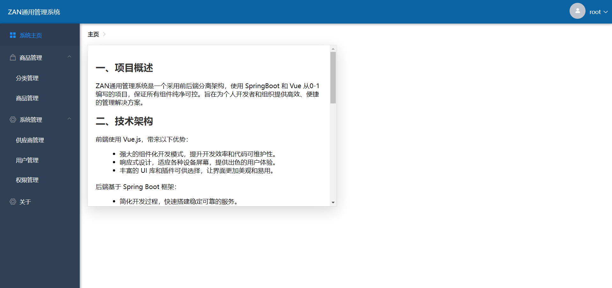

# ZAN-management通用管理系统帮助文档
## 一、项目概述
ZAN 通用管理系统是一个功能强大、采用前后端分离架构的管理工具。它结合了 Spring Boot 和 Vue.js 技术，为用户提供高效、便捷的管理解决方案。

## 二、主要功能
- 商品管理：包括商品的添加、编辑、删除、查询等功能。
- 分类管理：对商品进行分类，方便管理和查找。
- 系统管理：负责系统的配置和维护。
- 供应商管理：管理供应商信息。
- 用户管理：用户的创建、编辑、删除和权限分配。
- 权限管理：控制用户对系统资源的访问权限。

## 三、下载与启动
### （一）下载项目
1. 使用 Git 克隆项目到本地：
   ```
   git clone https://github.com/zouzanyan/ZAN-management
   ```

### （二）启动项目
1. 启动前端：
    - 进入前端项目目录：
      ```
      cd z-manager
      ```
    - 安装依赖：
      ```
      npm install
      ```
    - 启动前端服务：
      ```
      npm run serve
      ```
2. 启动后端：
    - 进入后端项目目录：
      ```
      cd ZAN-managemant
      ```
    - 安装依赖：
      ```
      mvn install
      ```
    - 启动后端服务：
      ```
      java -jar target/zan-backend.jar
      ```

## 四、在线体验地址

http://106.75.246.193:8080/

登陆用户名: 1234,登陆密码: 1234

## 五、截图示例




